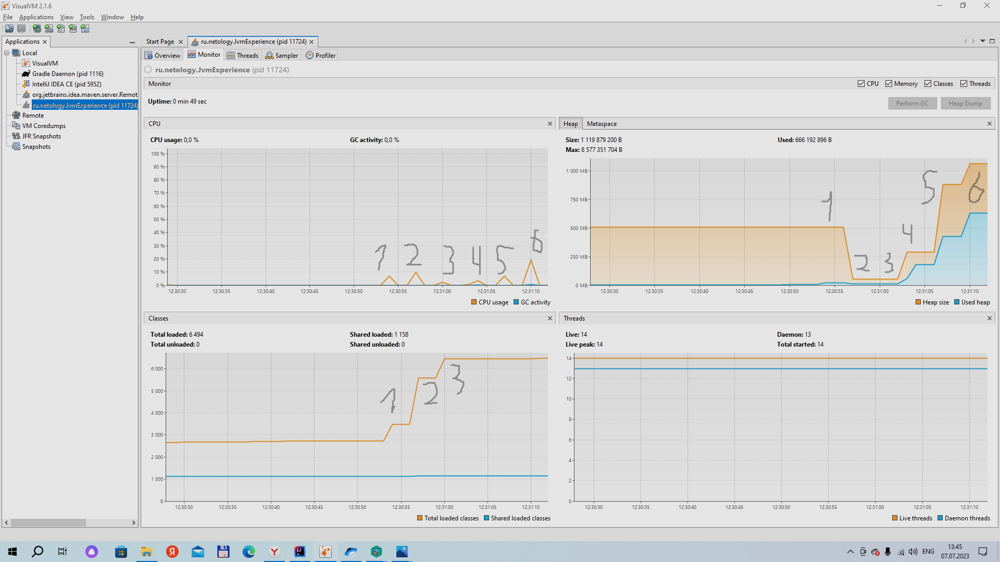

# Задача "Понимание JVM"

## Описание
Просмотрите код ниже и опишите (текстово или с картинками) каждую строку с точки зрения происходящего в JVM  

Не забудьте упомянуть про: 
- ClassLoader'ы, 
- области памяти (стэк (и его фреймы), хип, метаспейс)  
- сборщик мусора

## Код для исследования
```java

public class JvmComprehension {

    public static void main(String[] args) {
        int i = 1;                      // 1
        Object o = new Object();        // 2
        Integer ii = 2;                 // 3
        printAll(o, i, ii);             // 4
        System.out.println("finished"); // 7
    }

    private static void printAll(Object o, int i, Integer ii) {
        Integer uselessVar = 700;                   // 5
        System.out.println(o.toString() + i + ii);  // 6
    }
}

```

## Выполнение

При запуске программы сначала классы отдаются для загрузки в ClassLoader. Подгружаются: JvmComprehension, String, Object, Integer, System. 

Далее происходит Связавыние Linking: Здесь происходит подготовка классов к выполнению:

● проверка, что код валиден,

● подготовка примитивов в статических полях,

● связывание ссылок на другие классы

Далее данные, попадают в  Metaspace, Stack Memory и Heap.

Сначала создаётся фрейм main в Stack Memory

1 - в фрейме main int i = 1. В Metaspace - JvmComprehension.class.

2 - в Heap - Object, в фрейме main o.

3 - в Heap - Integer, в фрейме main Integer ii = 2.

4 - создаётся фрейм в Stack Memory printAll. В этом фрейме появляются Object o, int i, Integer ii.

5 - в фрейме printAll  Integer uselessVar = 700.

6 - Создастся новый фрейм в Stack Memory, куда передадим ссылку на o, i, i1. Сборщик мусора для uselessVar.

7 - Создастся новый фрейм в Stack Memory.


# Задача "Исследование JVM через VisualVM"

## Описание
Предлагаем вам изучить использование памяти через VisualVM при загрузке новых классов и создании новых объектов

### Результат вывода в консоль.
```
Starting Gradle Daemon...
Gradle Daemon started in 1 s 388 ms
> Task :compileJava UP-TO-DATE
> Task :processResources NO-SOURCE
> Task :classes UP-TO-DATE

> Task :JvmExperience.main()
Please open 'ru.netology.JvmExperience' in VisualVm
12:23:57.275624100: loading io.vertx
12:23:57.574691800: loaded 529 classes
12:24:00.582244200: loading io.netty
12:24:01.044643900: loaded 2117 classes
12:24:04.054910600: loading org.springframework
12:24:04.251571900: loaded 869 classes
12:24:07.262091600: now see heap
12:24:07.263078: creating 5000000 objects
12:24:07.354107700: created
12:24:10.360541100: creating 5000000 objects
12:24:10.528567400: created
12:24:13.554225800: creating 5000000 objects
12:24:13.677254700: created

Deprecated Gradle features were used in this build, making it incompatible with Gradle 8.0.

You can use '--warning-mode all' to show the individual deprecation warnings and determine if they come from your own scripts or plugins.

See https://docs.gradle.org/7.6/userguide/command_line_interface.html#sec:command_line_warnings

BUILD SUCCESSFUL in 55s
2 actionable tasks: 1 executed, 1 up-to-date
12:24:16: Execution finished ':JvmExperience.main()'.
```

### Мониторинг посредством VisualVM




1 - 25 секунда - loading io.vertx, loaded 529 classes. Увеличилось Metaspace для хранения объектов и использование процессора.

2 - 28 секунда - loading io.netty, loaded 2117 classes. Значительно вырос Metaspace, но также уменьшился Heap size, сработала сборка мусора.

3 - 34 секунда - loading org.springframework, loaded 869 classes. Значительно выросли Metaspace и Heap size.

4 - 35 секунда - первое creating 5000000 objects. Metaspace немного увеличился. Значительно увеличился Heap size.

5 - 38 секунда - второе creating 5000000 objects. Metaspace незначительно вырос. Значительно увеличился Heap size. Также возрасла активность процессора.

6 - 41 секунда - третье creating 5000000 objects. Metaspace не изменился. Значительно увеличился Heap size и активность процессора.
